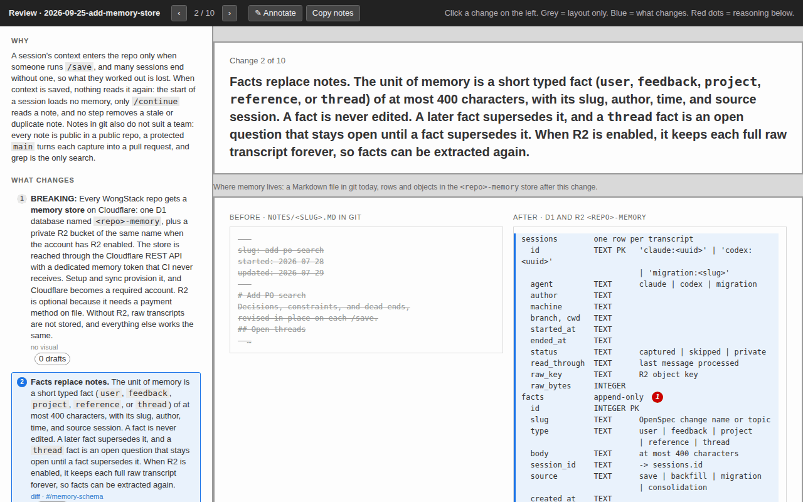

# WongStack

[](https://github.com/matthewwong525/WongStack/actions/workflows/test.yml)
[](LICENSE)
[](VERSION)

**Coding agents forget your decisions between sessions, and your process lives in chat and in people's heads.** WongStack keeps the process, the plans, and the decisions in the repo, and gives agents a repeatable loop that writes down what each change teaches.



*Each plan gets a `review.html` page like this. You read each change, see it drawn, and add notes before any code is written.*

## Start here

Make an **empty folder** and open it in your coding agent. Have a free [Cloudflare](https://cloudflare.com) account ready. Then paste this:

```
Read and follow
https://raw.githubusercontent.com/matthewwong525/WongStack/refs/heads/main/.agents/skills/wong-setup/SKILL.md
to install WongStack in this folder and walk me through the first workflow.
```

The agent asks for one Cloudflare token first, with the [exact click path](wiki/stack/cloudflare-credentials.md#create-the-token). Then it asks how you work, plans the install, applies it, and saves the result. You end with the workflow, a starter app online, and session memory. In a folder that already has files, setup stops and says so.

Claude Code and Codex get full support. Other agents, such as Cursor, can follow the workflow skills, because they are plain Markdown files. They get no hooks and no session memory.

## What you get

- **Process in the repo**, not in chats, docs, and people's heads.
- **One command for each stage of the work**, from the first idea to the merge.
- **A record written during the work.** Plans, decisions, and lessons are written down as part of each step, not afterward.
- **A reviewable package** for each change, which your team inspects before it joins `main`.
- **[Memory across sessions](wiki/development/memory.md).** Each session starts with the facts that earlier sessions learned. The store is in your Cloudflare account, not in git.
- **An assistant as well as a builder.** Plain requests get done directly, what the agent learns grows the wiki, and your [home](wiki/development/home.md) repo carries who you are into every other repo.
- **No lock-in to one agent.** The durable part is the files in the repo.

## The commands

```text
/explore -> /plan -> /apply -> /save -> /continue -> /ship
```

You do not have to run each one. A command whose input is missing runs the one before it, so `/apply` plans first when there is no plan. [The change loop](wiki/development/the-change-loop.md) owns the details.

| Command | What it does |
| --- | --- |
| `/explore` | Think through an idea before you decide what to do. |
| `/plan` | Write the plan, tasks, and decisions, and build the `review.html` page. |
| `/apply` | Do the planned work, then save it when every task is complete. |
| `/save` | Commit, push, open or update the pull request, and wait for CI. A plain conversation saves only its facts. |
| `/continue` | Pick up saved work later, from any machine or session. |
| `/ship` | Finish the change, merge it, and keep the record of what shipped. |
| `/improve [area]` | Review recent work and one area, then ship one maintenance fix. `--audit-only` reports findings with no edits. |
| `/routine <when>: <prompt>` | Run a prompt or command on a schedule. Optional: it needs [Paseo](https://paseo.sh). |
| `/wong-sync` | Get the latest WongStack and plan the update, up to a review page. |

Setup puts the app online on [the Cloudflare stack](wiki/stack/README.md): each change gets a preview link, and a merge deploys it.

## How it compares

| | Plain [`AGENTS.md`](https://agents.md) | [OpenSpec](https://github.com/Fission-AI/OpenSpec) alone | [GitHub Spec Kit](https://github.com/github/spec-kit) | WongStack |
| --- | --- | --- | --- | --- |
| Agent instructions in the repo | Yes | Yes | Yes | Yes |
| Plans and specs in the repo | No | Yes | Yes | Yes, through OpenSpec |
| Git steps | No | No | Branches and commits, with the opt-in [git extension](https://github.com/github/spec-kit/tree/main/extensions/git) | Branch, commit, PR, CI wait, and merge |
| Facts kept between sessions | No | No | No | Yes |
| Preview deploy per change | No | No | No | Yes, on Cloudflare |
| Agents | Many | 30+ tools | Many, by integration | Claude Code and Codex in full |
| Setup needs | One file | Node.js | Python 3.11+ and `uv` | Node.js, `gh`, and a Cloudflare account |

Checked against each project's README in September 2026.

## Repository layout

| Path | What it holds |
| --- | --- |
| [`AGENTS.md`](AGENTS.md) | The instructions each agent reads first. `CLAUDE.md` is a link to it. |
| [`.agents/`](.agents/) | The skills, path rules, hooks, and agent settings. `.claude` and `.codex` are links to it. |
| [`wiki/`](wiki/README.md) | Repeatable knowledge: process, people, the company, the project. |
| [`openspec/`](openspec/) | Active changes, shipped specs, and the archive of what shipped and why. |
| [`app/`](app/) | The starter app: React and Vite on a Cloudflare Worker. |
| [`schema/`](schema/) | The app's database migrations and staging seed data. |
| [`server/`](server/README.md) | The script that turns a fresh Ubuntu server into a workspace for agents. Fork it to change what your servers get. |
| [`scripts/`](scripts/) | The deploy pipeline, the payload checks, and the tests. |
| [`.github/`](.github/) | CI workflows, issue and PR templates, and [the contributing guide](.github/CONTRIBUTING.md). |
| [`VERSION`](VERSION), [`CHANGELOG.md`](CHANGELOG.md) | The current release, and what changed in each release. |
| [`LICENSE`](LICENSE), [`SECURITY.md`](SECURITY.md), [`CODE_OF_CONDUCT.md`](CODE_OF_CONDUCT.md) | MIT terms, how to report a vulnerability, and community rules. |
| [`.env.example`](.env.example), [`app/.dev.vars.example`](app/.dev.vars.example) | The names of the local and Worker secrets, with no values. |
| [`paseo.json`](paseo.json) | Copies `.env` into each new [Paseo](https://paseo.sh) worktree. |
| [`.nvmrc`](.nvmrc) | The Node.js version. |
| [`.gitattributes`](.gitattributes), [`.editorconfig`](.editorconfig), [`.gitignore`](.gitignore) | LF line endings, editor basics, and the files git ignores. |

## Requirements

- **A coding agent** that edits files, runs shell commands, and asks questions.
- **[`gh`](https://cli.github.com/)**, signed in, and **`git`**. Setup creates the GitHub repo.
- **[Node.js](https://nodejs.org/) 22**, the version in [`.nvmrc`](.nvmrc).
- **[OpenSpec](https://github.com/Fission-AI/OpenSpec)**: `npm install -g @fission-ai/openspec@1.8.0`.
- **`curl`**, for Cloudflare provisioning.
- **A [Cloudflare](https://cloudflare.com) account** (the free plan works) and one user token. Cloudflare is required, because session memory and hosting run there. The token stays in the git-ignored `.env` on your computer. [`SECURITY.md`](SECURITY.md) says what each token can do, and [the credentials page](wiki/stack/cloudflare-credentials.md) has the click path.
- **On Windows**, run `git config --global core.symlinks true` and turn on Developer Mode before you clone. The skills folder links are symbolic links ([why](wiki/development/required-tools.md#symbolic-links-in-the-agent-folder)).

The setup prompt helps with missing pieces. [Required tools](wiki/development/required-tools.md) says why each is needed.

## Work from the source

Fork first, then clone your fork:

```bash
gh repo fork matthewwong525/WongStack --clone && cd WongStack
```

A clone of this repository sends `/save` pushes to a repository you cannot write to. In your fork, the commands work, because this repo uses WongStack itself. Session memory stays off: [`.agents/.wong-stack.json`](.agents/.wong-stack.json) names the maintainer's store, and you have no token for it. [The contributing guide](.github/CONTRIBUTING.md) says how to send a change back.

## Learn more

- [Wiki](wiki/README.md): the guide to WongStack's process, and [the terms the agent may use](wiki/README.md#terms-the-agent-may-use).
- [AI knowledge centers](wiki/agent-knowledge-center.md): the six principles behind WongStack.
- [The change loop](wiki/development/the-change-loop.md): how work moves from idea to shipped record.
- [Working on WongStack](wiki/development/README.md): how to change the toolkit itself.
- [Changelog](CHANGELOG.md): what changed between releases.

## License

WongStack is released under the [MIT License](LICENSE).
