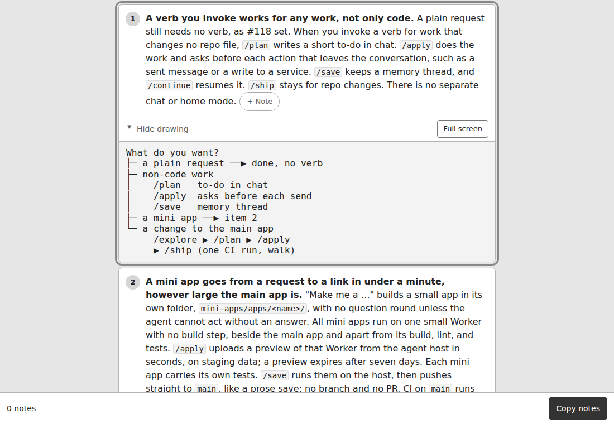

# WongStack

[](https://github.com/matthewwong525/WongStack/actions/workflows/test.yml)
[](LICENSE)
[](VERSION)

**Your own AI assistant that remembers you and gets things done.** Ask in plain words, the way you would ask a person. It does the task, keeps what it learns about you, and can build and publish small apps for you. Everything it knows lives in files you own, not in someone else's app.

## What you can ask

- *"Find three quiet cafés near the office that open before 8."*
- *"Plan my week around the Thursday deadline."*
- *"Every weekday at 9, list what is due today."* With the optional [Paseo](https://paseo.sh) app, it runs on a schedule.
- *"Make me a page that splits a restaurant bill."* You read a short plan, get a link to try it, and say publish to put it live.
- *"Remember that I prefer short answers."* It still knows next week.

It asks before it sends, buys, or deletes anything.

## Start in three steps

1. **Open a chat app for AI agents.** The easiest is the [Claude desktop app](https://claude.ai/download) (the Code tab), which needs no terminal. Any coding agent that can read and edit files and run commands works too.
2. **Make an empty folder, open it there, and paste this:**

   ```
   Read and follow
   https://raw.githubusercontent.com/matthewwong525/WongStack/refs/heads/main/.agents/skills/wong-setup/SKILL.md
   to install WongStack in this folder and walk me through the first workflow.
   ```

3. **Answer a few questions.** The agent installs any free tools it still needs, after asking. You approve a sign-in code for a free [GitHub](https://github.com/signup) account, where your files are kept. Then you paste one key from a free [Cloudflare](https://cloudflare.com) account, where your apps run. The agent shows you the [exact clicks](wiki/stack/cloudflare-credentials.md#create-the-token).

You end with a working assistant, a starter site online, and memory that carries over between chats. [Getting started](wiki/stack/getting-started.md) walks through each step and says what you do by hand. In a folder that already has files, setup stops and says so.

## Where you chat

- **On your computer:** the Claude desktop app, or [Codex](https://openai.com/codex). Both get full support, including memory.
- **On your phone:** the [Paseo](https://paseo.sh) app connects to your agent, so you can ask from anywhere. It also runs requests on a schedule, and gives each part of a bigger request its own workspace. It is optional.
- **Other agents,** such as Cursor, can follow the same steps, because they are plain text files. They get no memory between chats.

## What you get

- **An assistant that remembers.** Each chat starts with what earlier chats learned about you and your work. [Memory](wiki/development/memory.md) is kept in your own Cloudflare account.
- **Small apps from one request.** A [mini app](wiki/stack/mini-apps.md) gets a plan and a link to try, and goes live at `/apps/<name>/` when you publish it.
- **Your own site, online for free.** Every change gets its own link to look at before it goes live.
- **A notebook that grows.** What the assistant learns — how you like work done, who is who — goes into [a wiki](wiki/README.md) it reads next time.
- **Your home base.** Your [home](wiki/development/home.md) folder carries who you are into every other project.
- **No lock-in.** It is plain files in a folder you own. Switch agents, and the knowledge comes with you.

## For developers

### How it works

**Coding agents forget your decisions between sessions, and your process lives in chat and in people's heads.** WongStack keeps the process, the plans, and the decisions in the repo, and gives agents a repeatable loop that writes down what each change teaches.



*Each plan gets a `review.html` page like this. You read each change and its text drawing, check each decision the agent asked or assumed, and tap **+ Note** on anything to comment before any code is written.*

### The commands

```text
/explore -> /plan -> /apply -> /save -> /continue -> /ship
```

You do not have to type them. Ask for what you want, such as "add a sign-up page", and the agent runs the commands. It stops twice: at the plan, which ends with a link to its review page, and before it publishes. The commands are shortcuts: `/ship` runs everything with no stops. A command whose input is missing runs the one before it, so `/apply` plans first when there is no plan. [The change loop](wiki/development/the-change-loop.md) owns the details.

| Command | What it does |
| --- | --- |
| `/explore` | Think through an idea before you decide what to do. |
| `/plan` | Write the plan, tasks, and decisions, and build the `review.html` page. For work that is not code, write a short to-do. |
| `/apply` | Do the planned work, then put it on a preview link from this machine. It saves nothing; it asks before each outward action in work that is not code. |
| `/save` | Commit, push, open or update the pull request, and wait for CI. A plain conversation saves only its facts. |
| `/continue` | Pick up saved work later, from any machine or session. |
| `/ship` | Finish the change, run CI once, walk the preview, merge, and keep the record of what shipped. |
| `/improve [area]` | Review recent work and one area, then ship one maintenance fix. `--audit-only` reports findings with no edits. |
| `/routine <when>: <prompt>` | Run a prompt or command on a schedule. Optional: it needs [Paseo](https://paseo.sh). |
| `/wong-sync` | Get the latest WongStack and plan the update, up to a review page. |

Setup puts the app online on [the Cloudflare stack](wiki/stack/README.md): each change gets a preview link, and a merge deploys it.

### How it compares

| | Plain [`AGENTS.md`](https://agents.md) | [OpenSpec](https://github.com/Fission-AI/OpenSpec) alone | [GitHub Spec Kit](https://github.com/github/spec-kit) | WongStack |
| --- | --- | --- | --- | --- |
| Agent instructions in the repo | Yes | Yes | Yes | Yes |
| Plans and specs in the repo | No | Yes | Yes | Yes, through OpenSpec |
| Git steps | No | No | Branches and commits, with the opt-in [git extension](https://github.com/github/spec-kit/tree/main/extensions/git) | Branch, commit, PR, CI wait, and merge |
| Facts kept between sessions | No | No | No | Yes |
| Preview deploy per change | No | No | No | Yes, on Cloudflare |
| Agents | Many | 30+ tools | Many, by integration | Claude Code and Codex in full |
| Setup needs | One file | Node.js | Python 3.11+ and `uv` | Node.js, `gh`, and a Cloudflare account |

Checked against each project's README in September 2026.

### Requirements

- **A coding agent** that edits files, runs shell commands, and asks questions.
- **`curl`**, which macOS, Windows, and most Linux systems include.
- **`git`**, **[`gh`](https://cli.github.com/)**, **[Node.js](https://nodejs.org/) 22** ([`.nvmrc`](.nvmrc)), and **[OpenSpec](https://github.com/Fission-AI/OpenSpec)**. Setup installs any that are missing, after asking, and signs `gh` in to GitHub with the scopes it needs.
- **A [Cloudflare](https://cloudflare.com) account** (the free plan works) and one user token, which stays on your computer. [`SECURITY.md`](SECURITY.md) says what each token can do.
- **On Windows**, symbolic links. Setup checks and walks you through Developer Mode; a clone you make yourself needs it first ([how](wiki/development/required-tools.md#symbolic-links-in-the-agent-folder)).

[Required tools](wiki/development/required-tools.md) says why each is needed.

### Repository layout

| Path | What it holds |
| --- | --- |
| [`AGENTS.md`](AGENTS.md) | The instructions each agent reads first. `CLAUDE.md` is a link to it. |
| [`.agents/`](.agents/) | The skills, path rules, hooks, and agent settings. `.claude` and `.codex` are links to it. |
| [`wiki/`](wiki/README.md) | Repeatable knowledge: process, people, the company, the project. |
| [`openspec/`](openspec/) | Active changes, shipped specs, and the archive of what shipped and why. |
| [`app/`](app/) | The starter app: React and Vite on a Cloudflare Worker. |
| [`schema/`](schema/) | The app's database migrations and staging seed data. |
| [`server/`](server/README.md) | The script that turns a fresh Ubuntu server into a workspace for agents. Fork it to change what your servers get. |
| [`scripts/`](scripts/) | The deploy pipeline, the payload checks, and the tests. |
| [`.github/`](.github/) | CI workflows, issue and PR templates, and [the contributing guide](.github/CONTRIBUTING.md). |
| [`VERSION`](VERSION), [`CHANGELOG.md`](CHANGELOG.md) | The current release, and what changed in each release. |
| [`LICENSE`](LICENSE), [`SECURITY.md`](SECURITY.md), [`CODE_OF_CONDUCT.md`](CODE_OF_CONDUCT.md) | MIT terms, how to report a vulnerability, and community rules. |
| [`.env.example`](.env.example), [`app/.dev.vars.example`](app/.dev.vars.example) | The names of the local and Worker secrets, with no values. |
| [`paseo.json`](paseo.json) | Copies `.env` into each new [Paseo](https://paseo.sh) worktree. |
| [`.nvmrc`](.nvmrc) | The Node.js version. |
| [`.gitattributes`](.gitattributes), [`.editorconfig`](.editorconfig), [`.gitignore`](.gitignore) | LF line endings, editor basics, and the files git ignores. |

### Work from the source

Fork first, then clone your fork:

```bash
gh repo fork matthewwong525/WongStack --clone && cd WongStack
```

A clone of this repository sends `/save` pushes to a repository you cannot write to. In your fork, the commands work, because this repo uses WongStack itself. Session memory stays off: [`.agents/.wong-stack.json`](.agents/.wong-stack.json) names the maintainer's store, and you have no token for it. [The contributing guide](.github/CONTRIBUTING.md) says how to send a change back.

## Learn more

- [Wiki](wiki/README.md): the guide to WongStack's process, and [the terms the agent may use](wiki/README.md#terms-the-agent-may-use).
- [AI knowledge centers](wiki/agent-knowledge-center.md): the six principles behind WongStack.
- [The change loop](wiki/development/the-change-loop.md): how work moves from idea to shipped record.
- [Working on WongStack](wiki/development/README.md): how to change the toolkit itself.
- [Changelog](CHANGELOG.md): what changed between releases.

## License

WongStack is released under the [MIT License](LICENSE).
