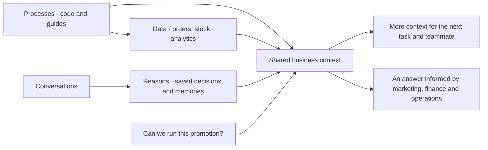

# WongStack

[](https://github.com/matthewwong525/WongStack/actions/workflows/test.yml)
[](LICENSE)
[](VERSION)

**Claude Code and Codex, for people who don't code.** WongStack sets up the software foundation for running your business, in accounts you own.


```mermaid
flowchart LR
  P["Processes · code and guides"] --> D["Data · orders, stock, analytics"]
  C["Conversations"] --> R["Reasons · saved decisions and memories"]
  P --> K["Shared business context"]
  D --> K
  R --> K
  K --> N["More context for the next task and teammate"]
  Q["Can we run this promotion?"] --> K
  K --> A["An answer informed by marketing, finance and operations"]
```

AI needs processes, data, and reasons together. Start with operations: AI helps turn repeatable processes into code, with guides for your team. Building those tools connects the data they need. Saved chats and memories keep the why behind decisions, in accounts you own.

As all three build up, the next task starts with more context. New teammates start with existing knowledge; questions draw on different departments to inform an answer, with access you choose. Any model or setup with a coding agent that reads and changes files and runs commands can use the framework. Your tools and knowledge stay yours.

## Start in three steps

1. **Open your assistant.** Any assistant that can read and change files and run commands on your computer works. [What I use](#what-i-use) names mine.
2. **Paste this into a new chat:**

   ```
   Install WongStack from github.com/matthewwong525/WongStack. Read and follow https://raw.githubusercontent.com/matthewwong525/WongStack/refs/heads/main/.agents/skills/wong-setup/SKILL.md
   ```

3. **Answer a few questions.** The agent asks before it installs any free tool it needs. You open one [link](wiki/stack/cloudflare-credentials.md#create-the-token) in a [Cloudflare](https://cloudflare.com) account, where your apps run, and paste the key it shows you. Your files are kept in Cloudflare too, on its paid plan (about $5 a month, Mac or Linux), or in a free [GitHub](https://github.com/signup) account: [the two ways](wiki/stack/artifacts-route.md).

You end with a working assistant, a starter site online, and memory that carries over between chats. Open the site and paste its *Make it yours* message, and the assistant makes the page yours. [Getting started](wiki/stack/getting-started.md) says what it costs, what you do by hand, and what to do when something goes wrong.

Paste the message in any folder: if it already has files, setup makes a `wongstack` folder in your home folder.

## What you get

- **Tools and a site you own.** Build a [mini app](wiki/stack/mini-apps.md) around your process. Review a plan and try a separate preview before publishing at `/apps/<name>/`.
- **Knowledge between tasks.** [Memory](wiki/development/memory.md) carries what earlier chats learned; [your wiki](wiki/README.md) keeps reusable business knowledge. Both stay in your own accounts.
- **Team access.** Each person uses their own assistant. Choose who can see and change what through [employee access](wiki/stack/employee-access.md).
- **Work beyond apps.** Ask for research, drafts, and errands. Your assistant can [use websites](wiki/development/browsing.md), asking when a step needs you. A [routine](wiki/stack/cloud-routines.md) runs on a schedule in your Cloudflare account, on its paid plan.
- **Freedom to change.** Your tools and knowledge stay yours. Switch assistants and take the context with you.

## What I use

I use [Claude Code](https://code.claude.com/docs/en/setup) in the free [Paseo](https://paseo.sh) app, on my laptop and my phone. [Codex](https://developers.openai.com/codex/cli) is set up too. WongStack works wherever your assistant works. Two things need one of these today:

- **A workspace for each assistant needs Paseo.** That is how several work at once. Without it, the parts of a request are done one at a time: [required tools](wiki/development/required-tools.md).
- **Memory loads by itself in Claude Code and Codex.** Another assistant reads the same files, and looks memory up when you ask: [memory](wiki/development/memory.md).

## Requirements

You bring an assistant on a plan of your own, such as Claude or ChatGPT, and a [Cloudflare](https://cloudflare.com) account. The free way to install adds a free [GitHub](https://github.com/signup) account, and works on Mac, Windows, or Linux; [step 3](#start-in-three-steps) says what the other way costs. Setup asks, then installs what is missing: `git`, [Node.js](https://nodejs.org/) 22, [OpenSpec](https://github.com/Fission-AI/OpenSpec), and, for the free way, GitHub's tool [`gh`](https://cli.github.com/). The one Cloudflare token you make stays on your computer; [`SECURITY.md`](SECURITY.md) says what each token can do. [Required tools](wiki/development/required-tools.md) says why each is needed, and what [Windows](wiki/development/required-tools.md#symbolic-links-in-the-agent-folder) adds.

## Learn more

- [Wiki](wiki/README.md): the guide to WongStack's process, and [the terms the agent may use](wiki/README.md#terms-the-agent-may-use).
- [AI knowledge centers](wiki/agent-knowledge-center.md): the six principles behind WongStack.
- [The change loop](wiki/development/the-change-loop.md): how work moves from idea to shipped record.
- [Make WongStack your own](wiki/stack/customizing-wongstack.md): start every new project from your own fork.
- [Maintaining WongStack](wiki/maintaining/README.md): how to change the toolkit itself, and [the contributing guide](.github/CONTRIBUTING.md) to send a change back.
- [Changelog](CHANGELOG.md): what changed between releases.

## License

WongStack is released under the [MIT License](LICENSE).
